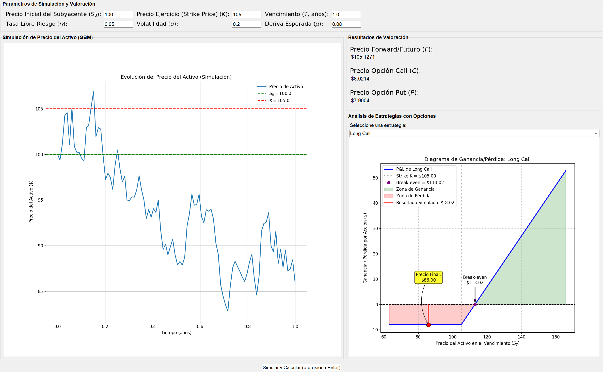

# European Option Pricing & Market Simulation Tool

[](https://www.python.org/downloads/)
[](https://opensource.org/licenses/MIT)

An interactive financial engineering tool developed in Python to price European derivatives and simulate asset price paths using stochastic processes. This project bridges the gap between theoretical quantitative finance and practical software development.

## 🚀 Overview

This application provides a comprehensive suite for:
* **Option Pricing:** Valuation of European Call and Put options using the Black-Scholes-Merton framework.
* **Linear Derivatives:** Valuation of Forwards and Futures contracts.
* **Stochastic Simulation:** Modeling underlying asset trajectories via Geometric Brownian Motion (GBM).
* **Interactive UI:** A clean, user-friendly interface built with `Tkinter` for real-time parameter adjustment and visualization.

## 🧠 Mathematical Framework

### Asset Price Simulation
The underlying asset price $S_t$ is assumed to follow a **Geometric Brownian Motion (GBM)**, governed by the following Stochastic Differential Equation (SDE):

$$dS_t = \mu S_t dt + \sigma S_t dW_t$$

Where:
* $S_t$ is the asset price at time $t$.
* $\mu$ (drift) represents the expected return.
* $\sigma$ (volatility) represents the statistical measure of dispersion of returns.
* $W_t$ is a Wiener process or Standard Brownian Motion.

### Option Valuation
The theoretical price for European options is calculated using the Black-Scholes formulas, considering the risk-neutral measure.

## 📊 Visualizations
The tool generates dynamic plots using `matplotlib` to visualize:
1. **Price Evolution:** Multiple simulated paths for the underlying asset.
2. **Strategy Payoffs:** Profit and Loss (P&L) diagrams for Long/Short positions at expiration.



## 🛠️ Tech Stack & Requirements
* **Language:** Python
* **Libraries:** * `NumPy`: For high-performance numerical calculations.
    * `SciPy`: For statistical distributions (norm.cdf).
    * `Matplotlib`: For financial data visualization.
    * `Tkinter`: For the Graphical User Interface (GUI).
    
    To install all dependencies automatically, run:
    ```bash
    pip install -r requirements.txt

## 📥 Installation & Usage

1. **Clone the repository:**
   ```bash
   git clone [https://github.com/CesarACabrera/validator-options-gmb.git](https://github.com/CesarACabrera/validator-options-gmb.git)